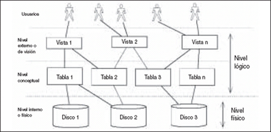
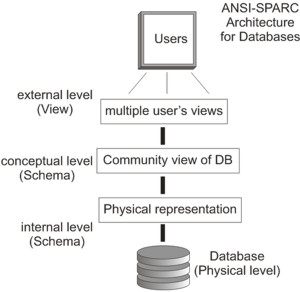
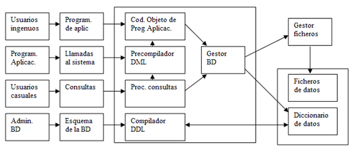
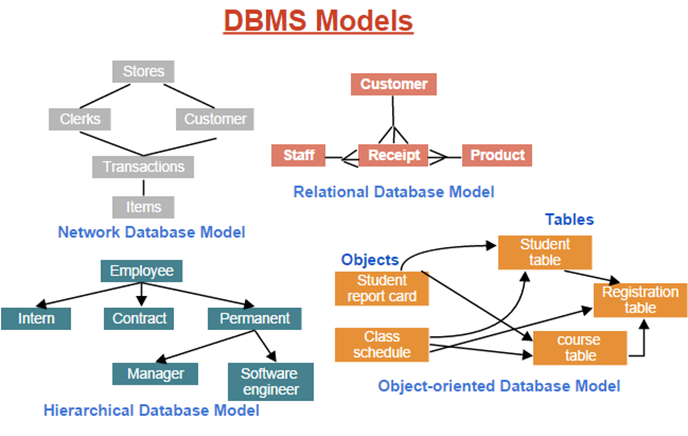

# Sistemas gestores de bases de datos

## Concepto de SGDB

- Colección de programas que permite crear y mantener una BD
- Objetivos
- Caracteríticas más importantes
- Ventajas e inconvenientes

## SGDB en el mercado:

Existen varios sistemas de gestión de base de datos disponibles en el mercado. Estos incluyen SGDB libres como PostgreSQL y SQLite, así como SGDB gratuitos y no libres, como Oracle Express Edition y SQL Server Compact Edition. Además, hay SGDB comerciales como MySQL, SQL Server, Oracle y dBase.

Libres, gratuitos y no libres, comerciales

- SGDB con soporte SQL
  - MySQL
  - PostgreSQL. Orientado a objetos y libre BSD. Incluye herencia entre tablas. Soporta tipos de datos especiales. Permite alta concurrencia. Diseñado para grandes volúmenes de datos.
  - SQL Server. Lenguaje T-SQL. Soporta transacciones, procedimientos almacenados. Incluye entorno gráfico
  - SQL Express edition. Se distribuye de forma gratuita
  - Oracle

## Componentes

- Usuarios
  - Administradores
  - Desarrolladores: crean programas que manipulan la BD
  - Usuarios finales: realizan consultas, introducen y actualizan datos
- Hardware
  - Dispositivos para el almacenamiento físico
  - Dispositivos que permiten la gestión de los mismos (CPU, unidades E/S, etc)
  - Puede ser un sistema de disco redundante o un servidor dedicado
- Software
  - Software que actúa como interfaz entre los datos y programas utilizados por usuarios
  - Independencia entre los programas y el SGDB
  - Acceso a datos a través del SGBD
- Datos
  - Información que contienen las BD así como las relaciones entre ellos
  - Se guardan físicamente en un dispositivo de almacenamiento
  - Los datos no aportan el conocimiento sino que deben ser interpretados

## Usuarios

### Administradores

Definen entidades y atributos que va a tener la BD
Define las estructuras de almacenamiento de los datos y los métodos de acceso
Monitoriza el rendimiento de la BD
Define procedimientos de respaldo y recuperación de información
Establece control de acceso
Realiza el control de la concurrencia
Mantiene la seguridad de los datos almacenados

### Desarrolladores

Crean programas que manipulan la base de datos mediante consultas.
Estos programas son los que permiten insertar, actualizar y eliminar datos

### Usuarios finales

Realizan consultas a la base de datos, introducen o actualizan datos, según los permisos que tengan sobre los objetos

## Lenguajes de un SGDB

- DDL: Definición de datos
- DML: Manipulación de datos
- SDL: Definición de almacenamiento
- DCL: Control de datos
- VDL: Definición de vistas

## Ventajas de disponer de un SGDB

- Control de la redundancia de información
- Consistencia de los datos
- Integridad de los datos
- Facilidad a la hora de mantener estándares establecidos
- Datos compartidos
- Mayor información de los datos
- Concurrencia
- Mayor eficiencia
- Mayor seguridad
- Accesibilidad a los datos
- Mejor mantenimiento
- Respaldo y recuperación ante fallos

## Funciones de un SGDB

Las funciones principales son:

- Definir
- Construir
- Manipular
- Seguridad: evitar acceso a personal no autilzado
- Integridad
- Respaldo: permitir hacer copias de seguridad para poder ser restauradas
- Concurrencia: permitir y controlar accesos simultáneos a los datos

## Arquitectura de un SGDB

Para conseguir características, se crea una arquitectura de 3 niveles propuesta por el comité ANSI/SPARC en 1975

La arquitectura ANSI/SPARC define 3 niveles:

- Nivel físico
- Nivel externo
- Nivel conceptual

### Nivel interno o físico

Describir la estructura de almacenamiento físico de las BD
Se utiliza un esquema interno, que describe los detalles del almacenamiento, así como los métodos de acceso.
Contiene caminos de acceso, codificación de los datos, Gestión del espacio, Tamaño de página

## Estructura de un SGDB

Un SGDB está formado por los siguientes componentes:

### Procesador de consultas

- Precompilador
- Compilador
- Interprete
- Motor de ejecución

### Gestor de almacenamiento

- Gestor de transacción
- Gestión de memoria intermedia
- Gestión de archivos

### Diccionario de datos

Es un repositorio de información que describe los datos de la base de datos (metadatos).

Ejemplo: para el módulo de control de autorización se necesitan:

- Nombres de usuarios
- Nombres de los ítems de datos
- Permisos para cada usuario y tipo de datos, así como tipo de acceso (insert, update, etc)

## Tipos de sistemas

### Según modelo de datos

#### Jerárquico

- Información estructurada en árboles
- Las relaciones se expresan mediante jerarquías. Al eliminar nodo padre se eliminan los hijos
- Sólo soporta relaciones de 1 a muchos (1:N)

#### Modelo de red (ampliación del jerárquico)

- Estructura de datos tipo árbol, un mismo hijo puede tener varios padres (complejidad)
- Soporta relaciones de muchos a muchos (N:M)

#### Modelo relacional

Conjunto de tablas que almacenan datos relacionados entre sí

#### Modelo orientado a objetos

Creado para trabajar con lenguajes de POO
Posibilidad de unir datos a funciones dentro de la BD de forma transparente al usuario

#### Modelo XML

Almacenan los datos en documentos XML (Xpath)

### Monousuario y multiusuario

### Centralizado y distribuido

### Enfoque que se da a los datos

- Tradicional
- Temporal
- Orientado a lógica
- Estadística
