- [1 Introducción](#1-introducción)
  - [¿Qué es una base de datos?](#qué-es-una-base-de-datos)
  - [¿Qué ventajas nos aporta una base datos?](#qué-ventajas-nos-aporta-una-base-datos)
  - [Ejemplos de bases de datos](#ejemplos-de-bases-de-datos)
    - [Información Académica](#información-académica)
    - [Información Hospitalaria](#información-hospitalaria)
- [2. INSTALACIÓN Y ENTORNO BASE ⚙️](#2-instalación-y-entorno-base-️)
  - [Libreoffice base](#libreoffice-base)
  - [Pasos para instalar Libreoffice](#pasos-para-instalar-libreoffice)
  - [Primera ejecución de Base y creación de base de datos](#primera-ejecución-de-base-y-creación-de-base-de-datos)
- [3. Crear una base de datos de peliculas](#3-crear-una-base-de-datos-de-peliculas)
  - [¿Dónde guardaremos nuestra base de datos?](#dónde-guardaremos-nuestra-base-de-datos)
- [4. Creamos nuestra primera tabla](#4-creamos-nuestra-primera-tabla)
  - [Tipos de datos](#tipos-de-datos)
  - [La clave primaria 🔑](#la-clave-primaria-)
  - [Asignar clave primaria](#asignar-clave-primaria)
  - [Guardar la tabla](#guardar-la-tabla)
- [5. Inserción de datos en la ``tabla PELICULAS``](#5-inserción-de-datos-en-la-tabla-peliculas)
- [6. Ordenar tablas](#6-ordenar-tablas)
  - [Ejemplo de ordenación](#ejemplo-de-ordenación)
- [7. Filtrado de datos ](#7-filtrado-de-datos-)
- [8. Editar y borrar ✏️❌](#8-editar-y-borrar-️)
- [9. Crear la ``tabla INTERPRETES``](#9-crear-la-tabla-interpretes)
- [10. Tipos de datos y edición de tablas](#10-tipos-de-datos-y-edición-de-tablas)
    - [Agregar o eliminar columnas](#agregar-o-eliminar-columnas)
    - [Modificación de columnas existentes](#modificación-de-columnas-existentes)
- [11. Relaciones entre tablas ↔️](#11-relaciones-entre-tablas-️)
  - [Tipos de relaciones entre tablas](#tipos-de-relaciones-entre-tablas)
    - [Uno a muchos (pelicula y género) 👤 - 👥](#uno-a-muchos-pelicula-y-género----)
    - [Uno a uno (1:1) 👤 - 👤](#uno-a-uno-11----)
    - [Muchos a muchos (N:M)  👥 - 👥](#muchos-a-muchos-nm-----)
  - [Selección de tablas](#selección-de-tablas)
  - [Crear relaciones](#crear-relaciones)
  - [Opciones de actualización y eliminación](#opciones-de-actualización-y-eliminación)
  - [Relación 2: películas e intérpretes](#relación-2-películas-e-intérpretes)
- [13. Relaciones intérprete, protagonistas y películas](#13-relaciones-intérprete-protagonistas-y-películas)
- [14. Consultas simples 🔍](#14-consultas-simples-)
- [15. Consultas sobre varias tablas combinando el asistente con el modo Diseño](#15-consultas-sobre-varias-tablas-combinando-el-asistente-con-el-modo-diseño)
- [16. CONSULTAS AVANZADAS](#16-consultas-avanzadas)
- [17. Consultas con funciones](#17-consultas-con-funciones)
- [18. Vistas. Consultas sobre vistas](#18-vistas-consultas-sobre-vistas)
  - [Convertir una consulta en una vista](#convertir-una-consulta-en-una-vista)
  - [Crear una consulta sobre la vista](#crear-una-consulta-sobre-la-vista)
- [19. FORMULARIOS 📋](#19-formularios-)
  - [Creación de formularios](#creación-de-formularios)
  - [Controles de formularios](#controles-de-formularios)
  - [Creación de un formulario básico.](#creación-de-un-formulario-básico)
  - [Guardar el formulario](#guardar-el-formulario)
  - [Guardar cambios](#guardar-cambios)
  - [Editar el formulario](#editar-el-formulario)
  - [Ejecutar el formulario](#ejecutar-el-formulario)
- [20. FAQ ❓🤔](#20-faq-)
  - [Me aparece un error al intentar guardar información en una tabla.](#me-aparece-un-error-al-intentar-guardar-información-en-una-tabla)
  - [No me deja rellenar una tabla](#no-me-deja-rellenar-una-tabla)
- [21. Práctica delincuentes](#21-práctica-delincuentes)
  - [Parte 1. Tabla denominada DELINCUENTES con los siguientes campos: (0.75 puntos)](#parte-1-tabla-denominada-delincuentes-con-los-siguientes-campos-075-puntos)
  - [Parte 2. Tabla denominada CONDENAS con estos campos (0.75 puntos):](#parte-2-tabla-denominada-condenas-con-estos-campos-075-puntos)
  - [Parte 3. Vamos a crear 2 tablas adicionales. Separa en tablas diferentes esta información: (1 punto)](#parte-3-vamos-a-crear-2-tablas-adicionales-separa-en-tablas-diferentes-esta-información-1-punto)
  - [Parte 4. Crea las relaciones que tu creas necesarias, teniendo en cuenta: (1,5 puntos)](#parte-4-crea-las-relaciones-que-tu-creas-necesarias-teniendo-en-cuenta-15-puntos)
  - [Parte 5. Diseña las siguientes consultas: (2 ptos.)](#parte-5-diseña-las-siguientes-consultas-2-ptos)
  - [Parte 6. Realiza un formulario que nos permita introducir y actualizar información sobre delincuentes  y otro formulario para insertar condenas (1 punto)](#parte-6-realiza-un-formulario-que-nos-permita-introducir-y-actualizar-información-sobre-delincuentes--y-otro-formulario-para-insertar-condenas-1-punto)
  - [Parte 7. Diseña los siguientes informes:  (1,5 puntos)](#parte-7-diseña-los-siguientes-informes--15-puntos)
  - [Parte 8. Conclusiones y dificultades encontradas (1 punto)](#parte-8-conclusiones-y-dificultades-encontradas-1-punto)

# 1 Introducción

## ¿Qué es una base de datos?

Una base de datos es un sistema organizado para recopilar, almacenar y gestionar datos. Permite a los usuarios almacenar, recuperar y manipular datos de manera eficiente.

Las bases de datos están estructuradas en tablas que contienen filas y columnas. Cada columna representa un tipo de datos específico y cada fila contiene una entrada de datos única.

## ¿Qué ventajas nos aporta una base datos?

**Estructura de datos**: Las bases de datos permiten organizar los datos en estructuras más complejas que los simples archivos de texto. Puedes tener tablas relacionadas entre sí, lo que facilita el manejo de datos complejos y su consulta.

**Búsqueda eficiente**: Las bases de datos están optimizadas para búsquedas rápidas y eficientes. Puedes buscar información en grandes conjuntos de datos de manera mucho más rápida que si tuvieras que hacerlo en un documento de texto extenso.

**Integridad y consistencia de datos**: Las bases de datos permiten definir reglas para asegurar que los datos sean coherentes y precisos. Se pueden establecer restricciones para evitar inconsistencias en los datos, lo cual es difícil de lograr en un documento de texto.

**Seguridad**: Las bases de datos pueden tener sistemas de seguridad avanzados para proteger los datos sensibles. Los documentos de texto, por otro lado, suelen estar menos protegidos y son más susceptibles a manipulaciones no autorizadas.

**Escalabilidad**: Las bases de datos pueden manejar grandes volúmenes de datos y son escalables. Puedes agregar más datos a medida que tu negocio crece, algo que podría ser problemático en un documento de texto.

**Concurrencia**: Las bases de datos permiten múltiples usuarios acceder y modificar datos simultáneamente sin corromper la información, algo que es difícil de gestionar en un documento de texto compartido.

**Recuperación de datos**: En caso de pérdida de datos, las bases de datos suelen tener sistemas de copia de seguridad y recuperación que facilitan la restauración de los datos a un estado anterior.

## Ejemplos de bases de datos

¿Qué tipos de bases de datos podemos encontrar?

Ejemplos de bases de datos podrían ser:

### Información Académica

En este caso, se pueden gestionar datos relacionados con estudiantes, profesores, evaluaciones y amonestaciones, entre otros.

La base de datos puede incluir detalles sobre los alumnos, como nombres, direcciones y fechas de nacimiento, así como información sobre profesores y sus especialidades.

Además, se pueden registrar evaluaciones, notas y cualquier amonestación disciplinaria que ocurra en el ámbito educativo.

### Información Hospitalaria

Las bases de datos también son fundamentales en entornos hospitalarios para organizar información relevante.

Esto puede incluir datos sobre pacientes, como historiales médicos, alergias y tratamientos anteriores.

Además, se pueden gestionar listas de espera para consultas y procedimientos, recetas médicas, detalles de enfermedades y datos sobre médicos, como sus horarios de consulta y especialidades.

# 2. INSTALACIÓN Y ENTORNO BASE ⚙️

## Libreoffice base

``Libreoffice`` es un conjunto de programas de ofimática, que además de ser libre, contiene otras herramientas como por ejemplo ``Calc`` o ``Writer``, que nos ayudan a redactar informes o realizar cálculos.

``Libreoffice base`` es un programa que nos permite guardar cualquier tipo de información de un tema en concreto en una base de datos, para actualizarla o consultarla en cualquier momento.

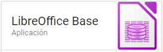

## Pasos para instalar Libreoffice

1. Visita el sitio web de LibreOffice: Abre tu navegador web y dirígete al sitio oficial de LibreOffice en https://www.libreoffice.org/.
2. Selecciona la opción "Descargar": En la página principal de LibreOffice, deberías ver un botón o enlace que dice "Descargar" o "Download". Haz clic en él.
3. Elige tu sistema operativo: Selecciona tu sistema operativo. LibreOffice es compatible con Windows, macOS y Linux. Asegúrate de elegir la versión correcta para tu sistema.
4. Selecciona la versión de LibreOffice: Verás varias opciones de descarga, incluyendo la suite completa y versiones específicas de cada programa, como Writer, Calc, Impress y Base. Asegúrate de que "Base" esté seleccionado.
5. Haz clic en "Descargar": Después de seleccionar Base y tu sistema operativo, haz clic en el botón "Descargar". El archivo de instalación se guardará en tu computadora.
6. Instala LibreOffice Base: Una vez que se haya descargado el archivo de instalación, ábrelo y sigue las instrucciones del asistente de instalación. Asegúrate de seleccionar la opción para instalar LibreOffice Base durante el proceso de instalación.
7. Completa la instalación: Sigue las instrucciones en pantalla para completar la instalación. Puedes personalizar la instalación según tus preferencias.
8. Inicia LibreOffice Base: Después de completar la instalación, busca el icono de LibreOffice en tu escritorio o menú de inicio y abre LibreOffice Base.

## Primera ejecución de Base y creación de base de datos

Base forma parte del paquete de ofimática de Libreoffice. Una vez tenemos instalado Libreoffice base buscamos en inicio hasta dar con la aplicación.

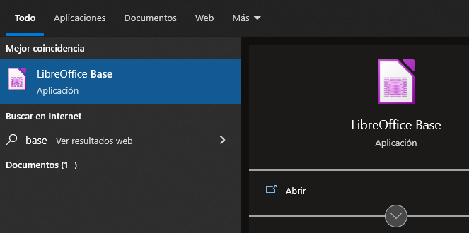

Al entrar en ``Base`` nos encontraremos la ventana ``Asistente para base de datos`` donde se nos da a elegir entre crear una nueva base de datos, abrir una base de datos existente o conectar con una base de datos existente.

# 3. Crear una base de datos de peliculas

Piensa en una base de datos como un archivo en el que vamos a guardar toda la información necesaria sobre la temática que queremos

En esta unidad se va a crear la base de datos que se usará el resto del curso; por tanto, en este caso, elegiremos la primera opción.

Una vez que esté creada y volvamos a entrar a Base tendremos que marcar la segunda opción y elegir nuestra base de datos.

Nos debe aparecer una ventana. Por un lado, debemos elegir entre registrar o no la base de datos y, por otro, entre abrir o no la base de datos para editarla y crear tablas usando el asistente. Lo vamos a dejar todo tal cual.

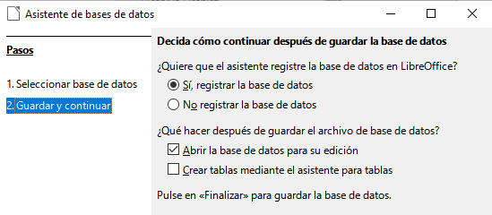

Para terminar, pulsamos sobre el botón finalizar.

## ¿Dónde guardaremos nuestra base de datos?

Es importante recordar dónde guardamos el archivo, puesto que en las próximas clases lo deberemos buscar para seguir trabajando.

La base de datos se guarda toda dentro de un único archivo en nuestro ordenador como este. La extensión que tienen los tipos de archivo de base de datos es ``.odb``. Aparecerá un icono que nos muestra que este archivo es un archivo de base.

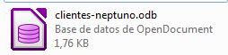

Para finalizar debemos elegir la carpeta donde guardaremos nuestra base de datos y el nombre de la misma.

La base de datos que vamos a crear se llamará Curso y la vamos a guardar en la subcarpeta Bases de Datos, dentro de la carpeta Escritorio

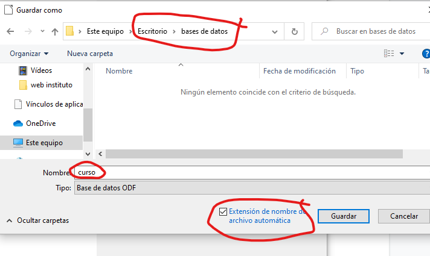

# 4. Creamos nuestra primera tabla

Las bases de datos guardan la información en una o más tablas. Cada tabla guardará un tipo de objeto o una relación entre varios.

Para ello nos situamos en el entorno en el menú de tablas y, dentro de las tareas, pulsamos sobre crear tabla en ``vista diseño``.

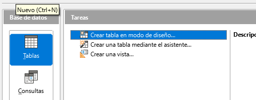

Nos aparece una pantalla para definir las columnas que tendrá la tabla . Por cada columna de nuestra futura tabla podemos indicar el nombre, el tipo de datos y una breve descripción sobre lo que almacenará dicha columna.

A continuación, nos aparecerá la siguiente ventana. Ahora aparece vacía porque acabamos de crear la tabla. Aquí vamos a definir qué campos va a contener nuestra tabla. Rellenaremos una fila para cada columna que queramos crear.

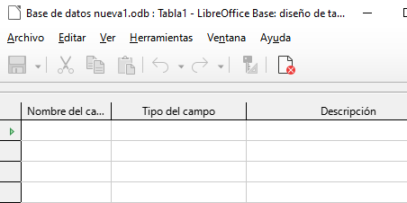

Comenzamos a definir el primer campo: nos situamos en la primera fila de la rejilla y en la columna ``Nombre del campo`` escribimos ``id_pelicula``. Digamos que es el número que le asignaremos a cada película que luego introduzcamos en la tabla.

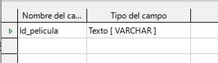

## Tipos de datos

A continuación, tenemos que especificar qué tipo de datos guarda este campo: ¿un número, un texto, una fecha?

Existen los siguientes tipoos de datos:

| Tipo de Datos | Uso                                                             | Ejemplo                                   | Ejemplo de Declaración                                                                                        |
| ------------- | --------------------------------------------------------------- | ----------------------------------------- | ------------------------------------------------------------------------------------------------------------- |
| Numeric       | Se utiliza para almacenar valores numéricos                     | 1, 3.14, -42, etc.                        | NUMERIC(10, 2) indica un número con hasta 10 dígitos, 2 de los cuales pueden estar después del punto decimal. |
| Varchar       | Se utiliza para almacenar cadenas de texto de longitud variable | Nombres, descripciones, etc.              | VARCHAR(255) indica una cadena de texto con una longitud máxima de 255 caracteres.                            |
| Date          | Se utiliza para almacenar valores de fecha                      | 2023-10-22                                | DATE indica un tipo de datos de fecha.                                                                        |
| Boolean       | Se utiliza para almacenar valores de verdad o falsedad          | Verdadero o falso, activado o desactivado | BOOLEAN o BOOL se utiliza para definir un tipo de datos booleano en algunas bases de datos.                   |

Por defecto, nos indica ``Texto[VARCHAR]`` como tipo de dato. En nuestro caso, para este campo vamos a elegir uno de los de tipo numérico llamado ``Número[Numeric]``

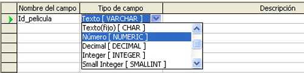

A continuación, en la columna ``Descripción``, sería aconsejable que se introdujese un comentario acerca del campo que se acaba de insertar

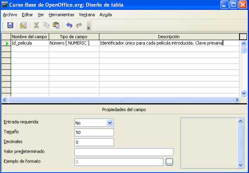

## La clave primaria 🔑

En el caso de nuestra tabla ``PELICULAS``, a priori, no hay ningún campo acerca de una película que podamos utilizar para diferenciar una película de otra.

Por ejemplo, podemos tener dos películas con el mismo título o dos películas con el mismo director o dos películas que se produjeron el mismo año.

Para este tipo de tablas se suele definir un campo de tipo numérico (como acabamos de hacer nosotros con nuestro ``id_pelicula``) que debe cumplir dos condiciones:

1. Ese campo siempre tiene que tomar un valor para cada fila de la tabla
2. Dicho valor no puede repetirse en ninguna fila.

Cuando un campo cumple estas dos propiedades (sin nulos y sin repetidos) se le llama ``clave primaria`` o ``clave principal``. Toda tabla debe tener una.

## Asignar clave primaria

Para indicar que queremos que el campo ``id_pelicula`` sea nuestra Llave Primaria seguimos los siguientes pasos:

Nos situamos en la parte izquierda del campo

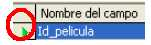

Pulsamos botón derecho del ratón

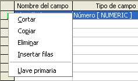

Seleccionamos la opción ``Llave primaria``

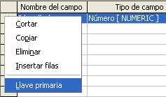

Quedando finalmente el campo como se muestra. La llave indica que este campo es la clave principal de la tabla.

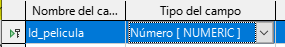

Una vez insertado este primer campo, insertaríamos el resto de columnas, que van a ser:

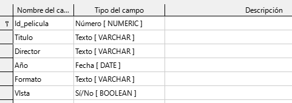

## Guardar la tabla

Una vez creados todos los campos con sus propiedades, debemos guardar la tabla. Para ello pulsamos sobre el icono en forma de disquete de la esquina superior izquierda

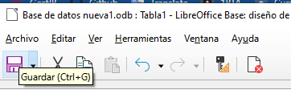

A continuación, nos aparece una ventana que nos pide que introducimos el nombre de la tabla. En dicha ventana introducimos el nombre Peliculas y pulsamos el botón Aceptar.

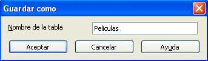

Si hemos seguido todos los pasos correctamente, nuestra ``tabla PELICULAS``debe aparecer dentro del apartado Tablas en la parte inferior de la ventana principal

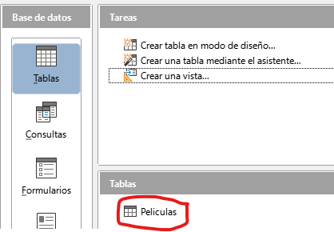

Las tildes pueden producir problemas por lo que es mejor evitar su uso en los nombres.

Si quisiéramos agregar o modificar columnas, elegimos editar.

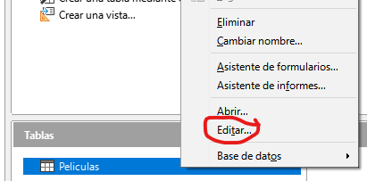

# 5. Inserción de datos en la ``tabla PELICULAS``

Para insertar datos a través de la hoja de datos tenemos que situarnos en la pantalla principal de en el apartado de ``Tablas`` y hacer doble clic con el botón izquierdo del ratón sobre la ``tabla PELICULAS`

Aparece entonces la pantalla de hoja de datos que se muestra.

En primer lugar, podemos ver que:

Aparecen las 6 columnas

- La columna ``Vista`` aparece con un cuadrado. Este cuadrado nos indica que es un campo del tipo Sí/No y que aparezca con fondo verde significa que no hay ninguna opción elegida por el momento.
- La flecha indica el lugar en el que se va a insertar la información.
- Para pasar de una celda a otra, recomiendo utilizar la tecla TAB.

A continuación, vamos a introducir la información de nuestra primera fila.

¡Ojo! No podemos dejar ninguna celda de la fila en blanco. De lo contrario, nos puede saltar un error

Deberá quedar así:

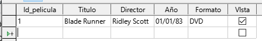

**Nota**: Como no sabemos el día exacto en el que se estrenó cada una de las películas que tenemos, vamos a indicar siempre el 1 de enero

Si queréis cambiar el ancho de las columnas podéis estirar de la siguiente barra y mover el ratón a izquierda o derecha

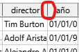

También, si hacéis ``doble clic`` en la línea de separación, se autoajusta el ancho de la columna al contenido de las celdas.

Si continuamos insertando filas, hay que hacer un recordatorio: la columna ``id_pelicula`` iba a ser nuestra Llave Primaria; es decir, que los valores de este campo, no podían repetirse para ninguna fila.

A continuación, rellenamos el resto de filas, con la información de las películas, tal como se muestra.

Poned la información tal cual. Si modificamos algo, en ejercicios posteriores no os cuadrará el resultado.

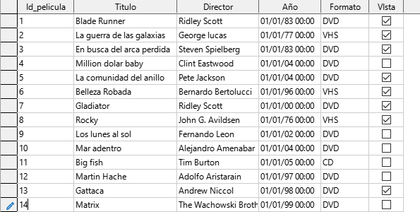

# 6. Ordenar tablas

Imaginad que queremos ver la lista por orden alfabético, o bien queremos ordenarlas de más nuevas a más antiguas. Para ello podemos ordenar la lista.

Podemos ordenar las filas según el valor de cualquiera de las columnas, tanto en orden descendente como ascendente.

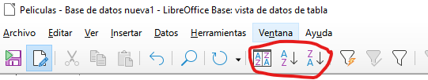

Dentro de las opciones de ordenación tenemos tres posibilidades:

1. Especificar los criterios de clasificación para visualizar los datos
2. Ordenar de forma ascendente
3. Ordenar de forma descendente en función de la columna elegida.

## Ejemplo de ordenación

Supongamos que deseamos ordenar nuestras filas:

1. En primer lugar, en función de la columna Formato de forma ascendente
2. En el caso de que tengamos valores repetidos para esta columna, queremos que aplique el orden alfabético de los nombres de los directores en el campo director
3. En caso de que el nombre del director aparezca repetido, que ordene de la película más reciente a la más antigua usando el campo ``Año``.

Es decir, los criterios de ordenación serían los que aparecen:

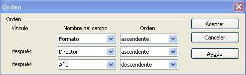

El resultado debería ser el siguiente. Si no os cuadra, comprobad que habéis puesto bien la información y los criterios de ordenación.

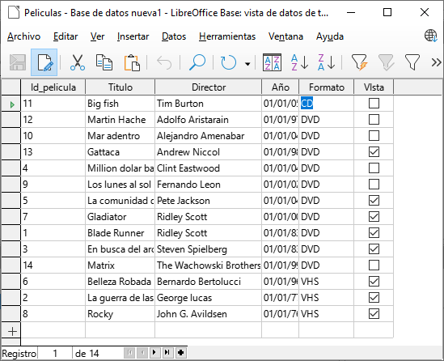

# 7. Filtrado de datos 

En ocasiones podemos querer buscar únicamente un conjunto de películas que cumplen cierta condición. Las opciones de filtrado de datos nos permiten elegir de forma simple qué datos queremos que se muestren.

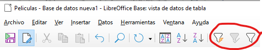

Elegid los siguientes valores para visualizar las películas entre 1980 y 1989. Para ello, filtraremos por el campo año.

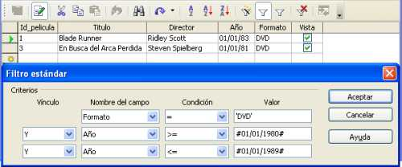

Tocarían dos resultados, que son los que coinciden con las condiciones que hemos establecido.

Lo que estamos viendo es la información filtrada, si volvemos a darle al icono del embudo , desactivaremos el filtro y veremos todas las películas de nuevo.

Si queremos modificar el filtro y volverlo a definir:

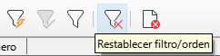

# 8. Editar y borrar ✏️❌

Para borrar una fila entera (no es necesario hacerlo), basta con:

1. Situarse con el cursor al inicio de la fila
2. Seleccionar ``eliminar fila``.

Por ejemplo, imaginemos que la peícula Rocky que tenía en VHS se ha estropeado y ya no se puede ver, entonces me sitúo al inicio de esa fila y selecciono eliminarla.

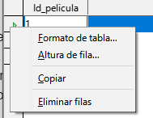

# 9. Crear la ``tabla INTERPRETES``

Las películas están protagonizadas por actores y actrices. Para poder relacionarlo todo, vamos a crear una tabla nueva.

Crearemos una tabla llamada ``INTERPRETES`` con los siguientes campos. Al igual que con las películas, crearemos un campo especial que será el número que daremos a cada intérprete.

Una vez creada la estructura de la tabla, deberemos insertar las siguientes filas en ella.

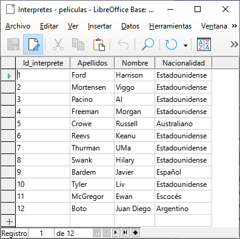

Ahora deberíamos tener dos tablas creadas. Repasa que están todos los datos en ella y que no se te ha olvidado nada, antes de continuar.

# 10. Tipos de datos y edición de tablas

Una vez creada, podemos editar las columnas que tiene una tabla para cambiarlas, agregar o eliminar alguna columna, etc. Para abrir esta tabla para editarla tenemos que situarnos en el apartado de ``Tablas`` y hacer un clic con el botón derecho del ratón y seleccionar la opción Editar

### Agregar o eliminar columnas

Para añadir nuevas columnas a nuestra tabla hay que seguir el mismo proceso que en la creación de una tabla; es decir, introducir un valor para el nombre del campo, elegir un tipo de campo y escribir una descripción de ese campo.

Para eliminar columnas de nuestra tabla nos situamos al inicio del campo y seleccionamos la opción ``eliminar``. Antes de eliminar una columna de nuestra tabla debemos saber que al hacerlo se borrarán todos los valores que tuviéramos dados a esta columna en nuestra filas.

En el caso de haber borrado una columna de la tabla accidentalmente siempre tenemos la opción de cerrar la ventana de edición sin guardar los cambios realizados.

### Modificación de columnas existentes

Las modificaciones que se pueden realizar sobre las columnas existentes pueden ser de dos tipos:

1. Cambios de nombre del campo o de la descripción del mismo.
2. Cambio en las propiedades del campo, desde ser o no clave primaria, a cambiar el tipo de campo y las propiedades asociadas a ese tipo de campo.

# 11. Relaciones entre tablas ↔️

Una de las grandes ventajas de las bases de datos es que podemos tener toda la información que necesitamos almacenar en varias tablas, relacionadas entre ellas, en lugar de una única tabla enorme con toda la información.

Se podría pensar en añadir una nueva columna (no la hagáis) a la ``tabla PELICULAS``que se llamara Género, de manera que por cada película almacenada también tuviera su género.

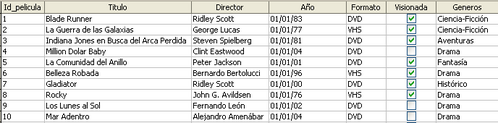

Si nos fijamos en esta solución podemos ver que se está repitiendo el mismo valor muchas veces, por ejemplo, Ciencia-Ficción aparece en cuatro filas y Drama en otras tantas.

¿Qué problemas podemos tener si lo hacemos así?

1. Que en algún momento nos equivoquemos al teclear, y escribamos, por ejemplo, Ciencia-Fusión.
2. Qué decidamos cambiar el nombre de un género, y por tanto tendríamos que cambiarlo en todas las filas.

La información de géneros la vamos a crear en una nueva tabla e indicaremos de alguna forma que hay filas de la ``tabla PELICULAS`` y de la ``tabla GENEROS`` que están relacionadas.

## Creamos la tabla géneros

Crearemos una nueva table y la llamaremos ``GENEROS`` con los siguientes campos. Marcaremos ``id_genero`` hay que ponerlo como clave principal.

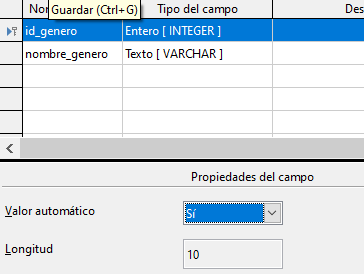

Seleccionado el campo ``id_genero``, vamos a marcar ``valor automático`` a SI. De este modo, no tendremos que rellenar este campo cuando rellenemos información de la tabla. En lugar de esto, se rellenará con el siguiente número disponible.

Y la guardamos con el nombre generos.

Ahora mismo deberíais tener 3 tablas:

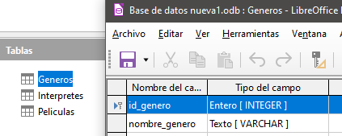

Vamos a rellenar la ``tabla GENEROS``. En la primera columna no tenemos que poner nada, siempre se pondrán los valores automáticamente cuando pasemos a la siguiente fila.

💡 Si no se autocompletan los números, revisa que ``genero`` sea clave principal.

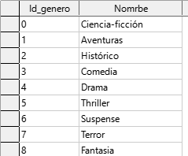

## Información de intérpretes

También vamos a suponer que quisiéramos almacenar información (apellidos, nombre y nacionalidad) acerca de los principales intérpretes con cada una de nuestras películas.

A pesar de haber creado una ``tabla INTERPRETES``  anteriormente, podríamos haber pensado en agregar columnas a la ``tabla PELICULAS``donde guardar la información acerca de sus protagonistas.

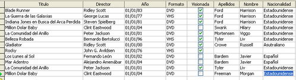

Esta solución es difícil de mantener y puede dar multitud de problemas y errores, por lo ya habíamos creado una ``tabla INTERPRETES``

## Tipos de relaciones entre tablas

Para ver la forma de establecer la relación es necesario decidir, previamente, qué tipo de relación existe entre las tablas. Existen tres tipos básicos de relaciones entre tablas:

### Uno a muchos (pelicula y género) 👤 - 👥

Cuando una fila de la primera tabla puede estar relacionada con muchas filas de la segunda tabla, pero una fila de la segunda sólo está relacionada con una de la primera.

Una película puede tener un único género pero un género puede serlo de varias películas.

### Uno a uno (1:1) 👤 - 👤

Cuando una fila de la primera tabla sólo puede estar relacionada con una fila de la segunda y viceversa.

Por ejemplo una tabla con países y otra con jefes de gobierno, dado que, normalmente, un país sólo tiene un jefe de gobierno y un jefe de gobierno lo es sólo de un país.

En función del tipo de relación, los pasos a realizar para indicarlas son distintos.

A continuación, se explica al detalle las reglas básicas para los tipos uno a muchos y muchos a muchos.

### Muchos a muchos (N:M)  👥 - 👥

Esta clase de relación ocurre cuando una fila de la primera tabla puede estar relacionada con muchas filas de la segunda tabla y una fila de la segunda tabla puede estarlo con muchas filas de la primera.

Un ejemplo de este tipo lo tenemos en la relación entre la ``tabla PELICULAS``y la ``tabla INTERPRETES``

Una película en particular puede tener muchos intérpretes y viceversa.

Para este tipo de relaciones la solución siempre es crear una nueva columna en la tabla del lado del muchos, es decir, debemos crear una nueva columna en la tabla cuyas filas sólo pueden estar relacionadas con una fila de la otra tabla, de manera que el valor de ese campo me indique sin lugar a dudas con qué fila está relacionada de la otra tabla.

En el caso de Generos y Peliculas, esto supone que tenemos que crear en la ``tabla PELICULAS`` un nuevo campo que para cada película mantenga un valor que me indique sin error al género al que pertenece.

Por tanto, la columna debe ser del mismo tipo de dato que la columna que sea clave primaria en la otra tabla y los valores que podrá contener será cualquiera de los valores que tome la clave primaria en dicha tabla.

En la ``tabla PELICULAS`` tendremos que crear una columna del mismo tipo que a la que llamaremos Genero.

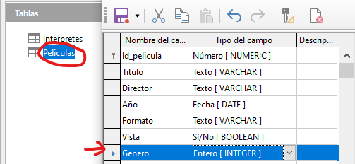

Los valores que pondremos en esa columna estarán comprendidos en los distintos valores que toma ese valor en la ``tabla GENEROS`` .

Como la columna que hemos creado en la ``tabla PELICULAS`` es nueva, tendremos que completarla con el número correspondiente al género al  que pertenece la película.

Falta indicarle que las dos tablas están relacionadas y que vamos a utilizar para mantener dicha relación la nueva columna ``genero`` que hemos creado en peliculas.

Para realizar esta operación tenemos que abrir la herramienta QUE SOLO ENCONTRARÉIS EN LA VENTANA PRINCIPAL, llamada Relaciones.

## Selección de tablas

Veréis que se abre una ventana nueva. Lo primero que nos ocurre nada más entrar en la ventana Relaciones. Seleccionamos cada tabla y le damos a añadir.

Deberemos ver esto. Las tablas que aquí vemos las podremos unir con flechas. Estas flechas que pondremos indicarán las relaciones que tienen entre ellas.

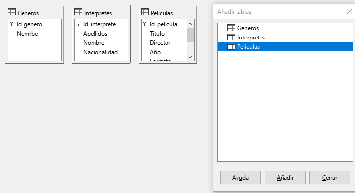

## Crear relaciones

Relación ``géneros - películas``

A continuación, ya podemos establecer la relación que queremos indicar. Para ello pinchamos en el icono que aparece a la derecha en la ventana relaciones

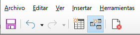

Entonces, nos debe aparecer una ventana donde primero debemos indicar las tablas que queremos relacionar para, a continuación, elegir en función de qué columna vamos a establecer la relación. Debería quedar así:

## Opciones de actualización y eliminación

En la parte inferior de esta ventana veremos que nos pide que indiquemos dos opciones:

1. la de actualización
2. la de eliminación

Nos ofrece cuatro posibilidades para cada una de ellas. Estas opciones sirven para indicar qué hacer si algún valor del campo de clave primaria que está siendo referenciada (en nuestro caso ``genero``) sufre alguna modificación o si esa fila es eliminada.

Para la actualización, lo normal suele ser elegir la posibilidad de actualizar en cascada, y para el borrado no existe una opción preferida, sino que dependerá bastante del contexto, en nuestro caso, para esta relación, indicaremos poner a nulos.

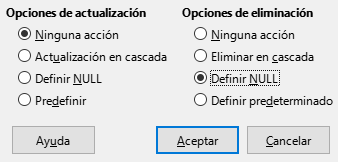

Una vez hemos terminado de indicar la relación, ésta debe aparecer indicada tal y como se muestra.

Ahora aparece una línea uniendo ambas tablas y que en el extremo de esa línea;

- En el lado de la ``tabla GENEROS`` aparece el valor 1
- En el extremo de la ``tabla PELICULAS``, nos aparece el valor n.

Estos valores nos están indicando que el tipo de relación es de uno (1) a muchos (n).

## Relación 2: películas e intérpretes

En este caso puede darse el caso de:

- 1 película que tiene N intérpretes
- 1 intérprete que participa en N películas

La relación entre películas e intérpretes es de muchos a muchos (N a N).

Cuando esto pasa, no basta con añadir una columna. Necesitamos crear una nueva tabla.

## Crear tabla PROTAGONISTAS

Puede darse el caso de:

- 1 película que tiene N intérpretes
- 1 intérprete que participa en N películas

La relación entre películas e intérpretes es de muchos a muchos (N a N). Cuando esto pasa, no basta con añadir una columna. Necesitamos crear una nueva tabla.

A esta tabla la llamaremos ``PROTAGONISTAS`` con, al menos, dos columnas:

- Identificador de película
- Identificador de intérprete cada una de ellas para apuntar a cada una de las claves primarias respectivas de las tablas que queremos relacionar

Cada fila de esta tabla va a representar las relaciones que existen entre las filas de ambas tablas.

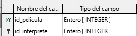

También marcaremos las dos como clave principal. Es decir, se puede repetir el campo película intérprete, pero no la combinación de ambos.

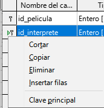

Rellenaremos a continuación el resto de la tabla.

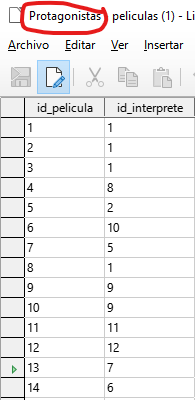

Rellenaremos la tabla, asignando a cada ``id_película``, un ``id_intérprete``. La tabla es la que veis a la izquierda. Si os fijáis:

- La película 1 es blade runner, protagonizada por Harrison ford (intérprete número 1)
- La película 2 es la guerra de las galaxias, protagonizada también por él (intérprete 1)

Etc.

Como veis la ``tabla PROTAGONISTAS`` enlaza las películas con sus intérpretes, y viceversa.

# 13. Relaciones intérprete, protagonistas y películas

Ahora hemos creado la ``tabla PROTAGONISTAS``, pero no está relacionada aún con las ``tablas PELICULAS y INTERPRETES``.  Para asegurarnos que todo funcione y que tengan información correcta, tenemos que relacionarlas.

Así, una vez que nos hemos situado de nuevo en la ventana Relaciones

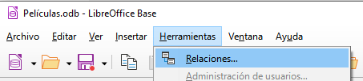

Añadimos las tablas que queremos relacionar a dicha ventana.

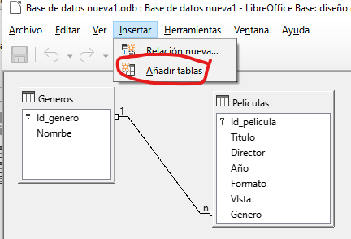

Aquí veis las dos tablas que hemos añadido, pero que no están conectadas con nada más. Ahora vamos a enlazar estas 3 tablas entre sí:

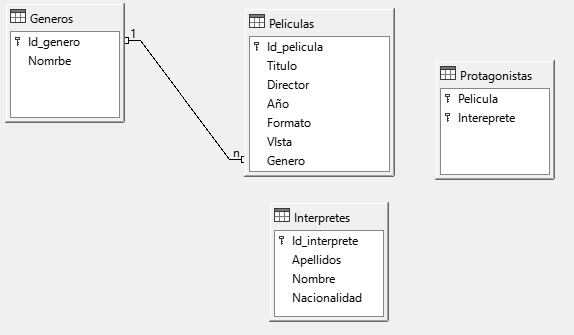

Relacionamos los campos ``id_pelicula`` de las dos tablas. Comprobaréis que aparece 1 y n, indicando que un valor de ``id_pelicula`` en la ``tabla PELICULAS``aparece más de una vez en la ``tabla protagonistas``.

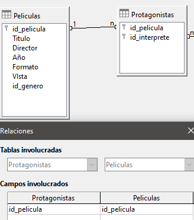

Del mismo modo relacionamos estas dos tablas, a través del campo ``id_interprete`` que aparece en ambas tablas.

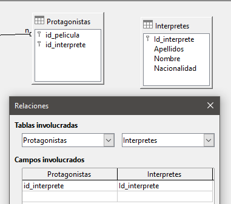

Resumiendo, al final las relaciones tienen que quedar así.

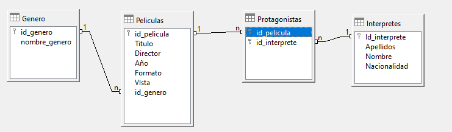

# 14. Consultas simples 🔍

Las ``consultas`` nos permiten visualizar parte de la información contenida en nuestras bases de datos desde una perspectiva más detallada. Se pueden realizar sobre una o varias tablas relacionadas. El resultado que devuelven se muestra también en forma de tabla.

Las consultas son muy útiles a la hora de construir formularios y, sobre todo, informes, como veremos más adelante.

La creación de consultas sobre una tabla se realiza utilizando el asistente. Vamos a comenzar realizando una consulta que nos devuelva de la tabla "Interpretes" el nombre, los apellidos y la nacionalidad de aquellos que no son españoles.

Para ello, teniendo seleccionada la sección "Consultas", nos situamos sobre el apartado de tareas y elegimos "Usar el asistente para crear consulta...".

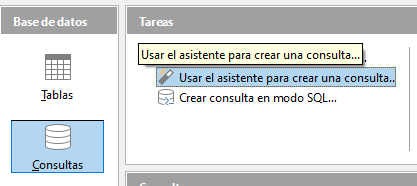

Nos aparece entonces la primera ventana del asistente donde debemos elegir qué campos queremos que se muestren, y seleccionamos entonces los campos Nombre, Apellidos,y Nacionalidad de la ``tabla INTERPRETES``.

Tiene que quedar así:

A continuación, podemos elegir si queremos que se muestren ordenados en función de los valores de uno o varios campos. Nosotros vamos a seleccionar que se ordenen alfabéticamente por los apellidos del intérprete.

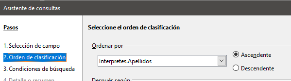

En el siguiente paso podemos elegir si queremos indicar uno o varios criterios de búsqueda; es decir, si queremos que las filas que se muestran cumplan alguna condición en particular.

Como en nuestro caso el objetivo es mostrar sólo los intérpretes no españoles, debemos indicar que para el campo Nacionalidad no deseamos aquellos que contengan el valor ``Español`` .

A continuación, podemos elegir con qué nombre (alias), se mostrarán las cabeceras de las columnas de los campos que hemos elegido al mostrar el resultado de la consulta. En este caso, como los nombres de los campos son bastante claros simplemente les quitamos el nombre de la tabla que figura delante del nombre .

A continuación podemos cambiar el nombre de la consulta si queremos:

Como resultado veremos el listado ordenado por apellido en orden ascendente, y evitando los intérpretes españoles.

Siempre que queramos hacer esta consulta, simplemente hacemos doble clic sobre su nombre:

# 15. Consultas sobre varias tablas combinando el asistente con el modo Diseño

Ahora vamos a realizar una consulta que nos muestre las películas junto con el nombre del género al que pertenecen.

Para realizar esta consulta primero vamos a utilizar el asistente para conseguir un primer ``borrador`` de la consulta que queremos realizar para, finalmente, acabar de concretar en modo Diseño.

Por tanto, empezamos de nuevo yendo a la sección tareas del tipo de objeto consulta y elegimos ``Usar el asistente para crear consulta…``.

Ahora, en la ventana inicial del asistente, elegimos los campos ``Titulo, Director, Año y Formato`` de la ``tabla PELICULAS``

En la siguiente ventana  vamos a indicar que queremos que el resultado se ordene, en primer lugar, en función del campo Director, y, en caso de coincidir el director entre distintas películas, en función del campo Titulo.

En esta consulta no vamos a poner ninguna condición por la que filtrar los datos, por lo que nos vamos directamente a la ventana ``Alias`` , donde vamos a aprovechar para ``maquillar`` que el campo Título no tuviera tilde al crear dicho campo y ahora sí se la incluimos. Además, para que el campo Año quede más concreto lo vamos a presentar como Fecha de estreno.

Antes de finalizar con el asistente, en la ventana ``Información general`` del mismo, debemos incluir el nombre de la consulta, que en este caso va a ser  ``Consulta_Peliculas_Generos``.

Vamos a indicar también que no queremos que se muestre el resultado de la consulta, sino que queremos seguir trabajando con ella en modo Diseño.

Para esto último debemos activar la casilla ``Modificar consulta`` en dicha ventana

Modo diseño

Nos debe aparecer entonces una ventana que permite crear consultas en modo Diseño.

En primer lugar, podemos ver que la ventana aparece dividida en dos partes bien diferenciadas:

- Una que contiene la tablas que estamos utilizando en la consulta
- Otra con los campos que ya habíamos seleccionado en el asistente junto con una serie de opciones que podemos indicar para cada uno de ellos.

Así, podemos ver que aparecen los campos ``Titulo, Director, Año y Formato`` junto con los alias que indicamos en el asistente y la opción de que se ordene la consulta en función del campo Director.

Algo que seguro nos ha llamado la atención es por qué aparece el campo Titulo dos veces. La respuesta es que, debido a que en el orden en que queremos que se muestren los campos es: primero el campo Titulo, y luego el Director, y en el asistente hemos indicado que primero queremos la ordenación en función del nombre del director, y, en caso de repetirse dicho nombre, ordenar por el título de la película.

La única forma de indicar esto es poniendo de nuevo el campo Titulo detrás de los otros cuatro, indicando que se ordene de manera ascendente pero desmarcando la casilla ``Visible`` para que no aparezca dos veces este campo en el resultado de la consulta.

Ya hemos visto entonces que en el modo Diseño nos aparecen los campos de Peliculas que deseamos pero aún no hemos hecho nada para ver el nombre del género de la película.

Como el nombre del género es un campo de la ``tabla GENEROS`` lo primero que tenemos que hacer es indicar que queremos incluir dicha tabla en la consulta. Para ello, debemos seleccionar el icono ``Añadir tablas``, que es el primero por la izquierda de los iconos de la fila inferior y elegir la ``tabla GENEROS``.

Podemos observar que automáticamente detecta que estas dos tablas están relacionadas.

Pues lo mismo que si hubiéramos intentado elegir los campos de ambas tablas directamente en el asistente, que la respuesta a la consulta hubiera sido que cada fila de la primera tabla aparecería unida a cada una de las filas de la otra tabla sin ningún criterio, es decir, en nuestro caso tendríamos 90 filas (resultado del producto cartesiano de 10 filas de Peliculas por 9 que tenemos en Generos) de las cuales 80 no significan nada.

Pero al haber indicado que existe la relación y detectarse en el modo Diseño conseguimos, sin necesidad de indicarlo explícitamente, que a la hora de mostrar todas las filas de Peliculas y Géneros, sólo nos muestre aquellas donde el valor para el campo por el que están relacionadas (Genero e ``id_genero`` respectivamente) sea el mismo, es decir, que sólo nos muestre juntas las filas de ambas tablas que realmente están relacionadas.

Una vez hemos añadido la ``tabla GENEROS``, elegimos qué campos queremos mostrar de ella. En este caso, nos basta con el campo Nombre.

Una vez que hemos elegido el campo, no debemos olvidar comprobar que la opción ``Visible`` está marcada para que se muestre este campo en el resultado de la consulta.

En la opción ``Alias`` del campo nombre_genero de la ``tabla GENEROS`` vamos a mostrar la palabra ``Género`` para que cualquier usuario entienda mejor lo que mostrará esta columna.

Dentro del modo Diseño podemos comprobar si la consulta devuelve lo que queremos sin necesidad de cerrar esta ventana y lanzar la consulta desde el menú principal.

Para ello, basta con seleccionar el icono de ejecución de la consulta que se encuentra situado el segundo por la derecha en la fila de iconos superiores. Así, nos aparece entonces en la parte superior de la ventana el resultado de la consulta.

Veremos que se nos muestran los resultados:

Si estamos conformes con el resultado, guardamos la consulta y podemos ver en la ventana principal que las dos consultas de esta unidad aparecen ya almacenadas.

# 16. CONSULTAS AVANZADAS

Entorno de trabajo en ``vista diseño``

En la unidad anterior ya trabajamos en modo diseño , pero ahora vamos a ver en detalle todos los elementos de esta forma de realizar consultas.

Primero, podemos observar que la ``vista diseño`` está dividida horizontalmente en tres partes:

La parte superior, con la barra de herramientas

La central, donde se muestran las tablas seleccionadas para la consulta

La inferior, donde cada columna representa cada uno de los campos a mostrar junto con una serie de opciones relacionadas para el filtrado de los resultados.

Vamos a crear nuestra primera consulta completamente en ``vista diseño``. En particular, vamos a crear una consulta que nos muestre todos los actores que protagonizan películas junto con los datos de la película, incluido el nombre del género. Es decir, vamos a construir una consulta que utiliza las cuatro tablas de nuestra base de datos.

Para empezar, nos vamos a la ventana principal, a la sección Consultas y seleccionamos la tarea Crear consulta en ``vista diseño``.

Seleccionar tablas a utilizar en la consulta

Nada más entrar en el modo Diseño, nos mostrará una ventana donde indicar las tablas que queremos incluir en la consulta que se va a crear. En nuestro caso, vamos a añadir las cuatro disponibles y veremos como nos muestra las relaciones existentes automáticamente.

Las puedes recolocar un poco para que te sea más fácil ver las relaciones

Especificar criterios de la consulta

A continuación, vamos a especificar que queremos que los resultados de la consulta se muestran ordenados por los apellidos y el nombre de los intérpretes.

Para incluir los campos de la ``tabla PELICULAS``vamos a seleccionar Peliculas:* y así no tenemos que incluir los campos uno a uno

Para seleccionar los campos de la ``tabla INTERPRETES`` no hemos utilizado la posibilidad ``Interpretes.*`` porque es necesario seleccionar cada campo individualmente, ya que vamos a establecer algún criterio de ordenación en función de alguno de los campos de la tabla.

Como en nuestro caso vamos a mostrar los resultados ordenados en función de los apellidos y el nombre de los intérpretes  necesitamos seleccionar uno a uno cada campo de Interpretes.

Para terminar, vamos a seleccionar el campo Nombre de la ``tabla GENEROS`` y, en el alias, vamos a poner ``NombreGenero``, para distinguirlo de los campos ya seleccionados, Nombre de la ``tabla INTERPRETES`` y genero de la ``tabla PELICULAS`.

Guardamos la consulta con el nombre ``ConsultaTotal`` y al ejecutarla el resultado es el siguiente:

# 17. Consultas con funciones

Imaginad que queremos un recuento de cuantas películas tenemos de cada género. Para ello necesitamos contar las que corresponden a cada género. Vamos a crear una consulta que realiza operaciones sobre los resultados.

Así, vamos a crear una consulta que muestre el nombre de cada género almacenado y el total de películas que tenemos de cada género. El resultado de nuestra consulta, con las filas que tenemos actualmente en Generos y Peliculas, debe ser como la siguiente:

El objetivo es realizar una consulta sobre Generos y Peliculas de manera que agrupemos las filas devueltas en función de cada género para así poder contarlas y poder saber el número de películas asociadas a cada uno de ellos.

Para empezar, elegimos las tablas sobre las que vamos a realizar la consulta, Generos y Peliculas.

Los campos que necesitamos son, por un lado, Nombre de Generos, que es sobre el que agruparemos los resultados devueltos y, por otro, un campo de la ``tabla PELICULAS``que estemos seguros que siempre tendrá un valor (no estará vacío) para cada fila de Peliculas.

Por ejemplo, podemos elegir el campo ``id_pelicula`` que siempre va a tener valor para cada película. Los campos seleccionados se muestran.

A continuación, debemos asociar la función correspondiente a cada uno de los dos campos.

En primer lugar, hemos dicho que queremos agrupar los resultados en función de cada género, para ello vamos a incluir la ``función agrupar`` asociada al campo Nombre de Generos.

En segundo lugar, lo que queremos es contar las películas relacionadas con cada género. Esto último lo conseguimos asociando la función ``Cantidad`` al campo ``id_pelicula`` de Peliculas.

Guardamos entonces la consulta como ``Peliculas de cada Genero``

Al lanzarla nos encontramos una pantalla como esta:

P
Como vemos, la cabecera con el total de películas está mostrando la función que estamos utilizando junto con el nombre del campo.

Si queremos que el resultado aparezca como el que mostraremos en la figura., es decir, con una cabecera significativa, debemos añadir el alias ``Total de Peliculas``.

# 18. Vistas. Consultas sobre vistas

Las ``vistas`` son un tipo especial de consultas almacenadas que, a nivel de bases de datos, se tratan como una tabla más.

¿Qué ocurre si necesitamos realizar una consulta no sobre una tabla sino sobre los resultados de otra consulta?

La respuesta es que debemos convertir la consulta en una vista para que se pueda manejar como si de una tabla se tratara.

Para ver los beneficios de usar vistas, vamos a realizar una consulta que nos devuelva el valor medio de las películas asociadas a cada género.

Esta consulta no se puede realizar directamente sobre las tablas Generos y Peliculas sino sobre la consulta Películas de cada Género una vez convertida en vista.

## Convertir una consulta en una vista

Para convertir una consulta en una vista nos situamos en la ventana principal  en la sección ``Consultas`` y:

Seleccionamos la consulta que queramos convertir con el botón derecho del ratón.

Del menú que se despliega seleccionamos la opción ``Crear como vista``.

Se nos despliega entonces una ventana donde tenemos que poner un nombre a la vista, escribimos ``PeliculasCadaGenero`` y aceptamos. Ya hemos convertido la consulta en una vista y podemos ver que ya es así si nos situamos en la sección ``Tablas`` de la ventana principal . Podemos observar que se usa un icono distinto para representar vistas y distinguirlas de las tablas.

## Crear una consulta sobre la vista

Una vez que ya tenemos la vista, vamos a crear una consulta sobre ella. Para empezar, vemos que al entrar en ``vista diseño`` para crear una nueva consulta ya nos aparece PeliculasCadaGenero como si de una tabla más se tratara y la elegimos como única tabla de la consulta.

Como sólo queremos que nos devuelva el valor medio de las películas de cada género seleccionamos el campo Total de Peliculas y le asociamos la función ``Promedio`` junto con el alias ``Media de cada género``.

Para ver que la consulta hace lo que esperamos en la propia ``vista diseño`` , la lanzamos antes de guardarla utilizando el botón ``Ejecutar`` y, si devuelve el valor esperado, ya hemos terminado.

# 19. FORMULARIOS 📋

Los usuarios sin conocimientos técnicos pueden utilizar bases de datos de manera más efectiva mediante la creación de formularios. Estos formularios simplifican la tarea de introducir y consultar información al permitir que los datos se ingresen de manera más organizada y limpia. En lugar de ingresar datos directamente en la tabla, los formularios actúan como interfaz para interactuar con la base de datos.

Es posible crear múltiples formularios para una misma tabla en una base de datos. Los formularios pueden abarcar varios campos de una tabla, incluso todos, y pueden también combinar campos de diferentes tablas o consultas. Mientras las tablas almacenan la información, los formularios facilitan la recopilación y entrada de datos de manera más accesible para usuarios no técnicos.

## Creación de formularios

Para crear un formulario nos vamos a encontrar dos posibilidades dentro del apartado de tareas disponibles en la sección formularios:

1. Creación de formularios en ``vista diseño``: permite crear un formulario totalmente personalizado.
2. Usar el asistente para crear formulario: crea automáticamente un formulario con los campos que el usuario seleccione.

Nosotros vamos a crear formularios en la ``vista diseño`` porque nos permite configurarlos con más detalles. Para ello pulsamos sobre ``Crear formulario en ``vista diseño``. Nos aparece entonces la ventana de diseño de formularios

## Controles de formularios

Toda la información de un formulario está contenida en los controles.

Los controles son objetos de un formulario que muestran datos, realizan acciones o decoran el formulario.

Los controles pueden ser dependientes, independientes o calculados:

- ``Control dependiente``: está unido a un campo de una tabla o consulta. Los controles dependientes se utilizan para mostrar, introducir y actualizar valores de los campos de la base de datos.
- ``Control independiente``: no tiene un origen en una tabla o consulta. Los controles independientes se pueden utilizar para mostrar información, líneas, rectángulos e imágenes, independientemente de que estos existan en la tabla creada de antemano.
- ``Control calculado``: el origen de los datos es una expresión, no un campo. Una expresión es una combinación de operadores (=,+,-,* y /), nombres de controles, nombres de campos, funciones que devuelven un solo valor y valores constantes. La expresión puede incluir datos de un campo de la tabla o consulta del formulario o datos de otro control del formulario.

Los distintos campos de control se encuentran repartidos en las dos barras de herramientas que aparecen resaltadas; por un lado, la barra ``Diseño de Formularios`` y, por otro, la barra ``Campos de control de formulario``.

Si esta última barra no nos apareciera por cualquier motivo, se puede acceder a ella a través del menú ``Ver``, eligiendo la opción ``Barra de Herramientas`` y activando la casilla ``Campos de control de formulario``.

Antes de conocer los controles más importantes de ambas barras es recomendable, para hacer más cómodo el diseño de formularios, incrustar la barra ``Campo de Control…`` con el resto de barras de herramientas; para ello, basta con hacer doble clic con el ratón sobre la cabecera de esta barra y la ventana de diseño de formularios nos quedará como aparece.

En esta última barra, por defecto, no aparecen todos los controles disponibles; si queremos que aparezcan todos, debemos pulsar el icono que abre la barra de herramientas ``Más campos de control`` y nuestra ventana de trabajo debería quedar como la que aparece

## Creación de un formulario básico.

El primer formulario que vamos a crear en ``vista diseño`` es uno para la ``tabla INTERPRETES`` que nos va a permitir introducir los intérpretes de una película.

Lo primero que vamos a hacer dentro de la ventana de edición de formularios es indicar cómo se va a llamar el formulario y con qué tabla va a estar conectado.

Para ello, pulsamos sobre el icono ``Navegador de formulario`` y hacemos clic con el botón derecho sobre el campo ``Formulario``, elegimos la opción ``Nuevo`` y, dentro de ésta, ``Formulario``.

Por defecto, al nuevo formulario lo llama Standard pero nosotros lo vamos a renombrar como Form_Interpretes.

Para indicar que el formulario va a estar conectado con la ``tabla INTERPRETES`` hacemos clic con el botón derecho del ratón en el navegador de formulario sobre Form_Interpretes y elegimos ``Propiedades``.

 

En el cuadro resultante, vamos a la ficha ``Datos``, y seleccionamos dentro ``Contenido``. Abrimos el menú desplegable y seleccionamos la tabla sobre la que vamos a construir el formulario, en nuestro caso Interpretes

## Guardar el formulario

Cerramos las ventanas ``Propiedades del formulario`` y ``Navegador de formulario`` y, antes de continuar, guardamos el formulario pulsando en la pestaña ``Archivo`` y dentro ``Guardar``, y también aquí le nombramos como Form_Interpretes.

Crear campo de texto

Ahora ya podemos continuar con la creación del formulario. En primer lugar, vamos a crear un campo de texto. Para ello,

Seleccionamos ``Campo de texto`` de entre todos los controles disponibles.

Veremos que el cursor cambia de forma, y es cuando podemos insertar dicho campo.

Llevamos el cursor a la posición de la zona de trabajo

Lo arrastramos hasta que el campo de texto alcance el tamaño deseado.

Ahora tenemos que dar unas propiedades al campo de texto y asignarle la tabla en la que se insertarán los datos introducidos desde este formulario.

Seleccionamos dicho cuadro con el botón derecho y nos sale un cuadro emergente, y dentro de él escogemos ``Campo de Control``.

En el cuadro resultante, vamos a la ficha ``Datos``, y seleccionamos dentro de ``Campo de datos`` el nombre del campo al cual se va a enlazar, en este caso, al campo ``id_interprete``.

Dentro de esta misma ventana de propiedades del campo, nos vamos a la ficha ``General`` al campo ``Nombre`` y escribimos Campo ``id_interprete``.

Una buena práctica es dar un nombre significativo a cada campo que creemos, sobre todo cuando tengamos formularios con muchos campos. Así, podremos distinguir bien cada campo dentro de la ventana ``Navegador de Formularios``.

Colocar un campo de etiqueta

Delante del campo de texto creado vamos a poner un ``Campo etiqueta`` para que cualquier usuario que utilice el formulario conozca lo que debe introducir.

Si hacemos doble clic sobre la etiqueta aparecerá una ventana donde podremos indicar las diferentes propiedades de la etiqueta (nombre que aparecerá en la etiqueta, color de fondo, tipo de letra, tamaño, color,...).

El formato de los formularios puede tener más colorido y distintas fuentes de texto.

Dentro de estas propiedades vemos que hay algunas que nos abren una nueva ventana como, por ejemplo, la propiedad ``Fuente`` donde podemos variar el tamaño y el tipo de la fuente del texto.

Una vez que hemos cambiado las propiedades de la etiqueta, nuestro formulario debería parecerse al de la figura.

Completar el resto de campos del formulario

Si repetimos los pasos realizados para el resto de los campos de la ``tabla INTERPRETES`` podríamos obtener un formulario parecido a este.

## Guardar cambios

Si salvamos los cambios realizados y cerramos la ventana de edición de formularios, en la ventana de objetos ya debe aparecer el formulario que acabamos de crear.

## Editar el formulario

Si queremos realizar algún cambio en el formato del formulario, pulsamos sobre el formulario con el botón derecho del ratón y elegimos la opción ‘Editar’.

## Ejecutar el formulario

En cambio, si lo que queremos es ejecutar el formulario para empezar a insertar datos hacemos doble clic sobre él .

Veréis que abajo aparece el número de registros (filas) que hay guardados en esta tabla y podremos ir viendo la información guardada en el formulario.

# 20. FAQ ❓🤔

## Me aparece un error al intentar guardar información en una tabla.

Recordad rellenar las filas de una en una, y no toda una columna

Es posible que alguno de los campos lo hayamos definido con una longitud corta y hayamos escrito algo más largo. Editar los campos de la tabla y revisarlo.

## No me deja rellenar una tabla

Comprueba que en la tabla hayas definido un campo como clave principal.

# 21. Práctica delincuentes

En esta prácticad deberéis crear una tabla de datos de cero por vuestra cuenta. La base de datos se tiene que llamar ``delincuentes`` y tiene que estar guardada en el archivo ``delincuentes.odb``.

La base de datos contendrá información de los delincuentes más buscados. Podéis inventaros los datos como nombres, fotos, etc. y poner los que queráis.

Al terminar la prácta deberéis entregar:

1. El archivo ``delincuentes.odb`` con vuestra base de datos
2. Una presentación de ``Google slides`` con capturas de todas las tablas, formularios y consultas, tanto de la definición como de los datos que contienen.

Realizado una base de datos para el FBI con los datos de los delincuentes más peligrosos en la que se incluyan los siguientes objetos:

## Parte 1. Tabla denominada DELINCUENTES con los siguientes campos: (0.75 puntos)

- Nº registro preso (clave primaria)
- Nombre
- Apellidos
- Fecha de nacimiento
- Fotografía (tipo imagen)
- DNI/Pasaporte
- ¿Está en la cárcel actualmente?

Rellena la tabla con al menos 10 registros

## Parte 2. Tabla denominada CONDENAS con estos campos (0.75 puntos):

- Nº Registro de condena (clave primaria)
- Identificación del preso
- Fecha de entrada
- Fecha de salida
- Prisión (Alcatraz, Guantánamo o Sing Sing). Este campo si queréis lo podéis sacar a otra tabla.
- Tiempo de condena (mejor en meses, a fin de que sea un número entero)

Rellena la tabla con al menos 8 condenas.

## Parte 3. Vamos a crear 2 tablas adicionales. Separa en tablas diferentes esta información: (1 punto)

Tabla nacionalidad. Una idea de tabla podría ser:

Tabla actividad delictiva. Una idea de tabla podría ser:

Piensa que necesitarás crear o modificar columnas en la tabla delincuentes para relacionar estas nuevas tablas.

No paséis a relaciones hasta que tengáis al menos estas cuatro tablas

## Parte 4. Crea las relaciones que tu creas necesarias, teniendo en cuenta: (1,5 puntos)

Un delincuente puede tener varias actividades delictivas

Una actividad delictiva puede corresponder a varios delincuentes

## Parte 5. Diseña las siguientes consultas: (2 ptos.)

Delincuentes de nacionalidad estadounidense (Nombres yapellidos)

Delincuentes nacidos entre los años 1960 y 1970. (Nombre, apellido y fecha de nacimiento)

Delincuentes que viven en Afganistán e Irak.
Número de delincuentes por nacionalidad.
Crea una consulta que genere los siguientes resultados:

## Parte 6. Realiza un formulario que nos permita introducir y actualizar información sobre delincuentes  y otro formulario para insertar condenas (1 punto)

## Parte 7. Diseña los siguientes informes:  (1,5 puntos)

Si necesitáis usar dos tablas para un informe, necesitaréis primero crear una consulta a partir de esas tablas, y a continuación crear un informe con esa consulta como fuente de datos.

Si tenéis que filtrar una tabla, necesitaréis en primer lugar crear una consulta, que sí nos permite establecer criterios para filtrar, y a continuación crear un informe a partir de los datos que genere esta consulta.

- a) Delincuentes.
- b) Delincuentes agrupados por prisión.
- c) Delincuentes agrupados por actividad delictiva
- d) Delincuentes ondenados por robo

## Parte 8. Conclusiones y dificultades encontradas (1 punto)
