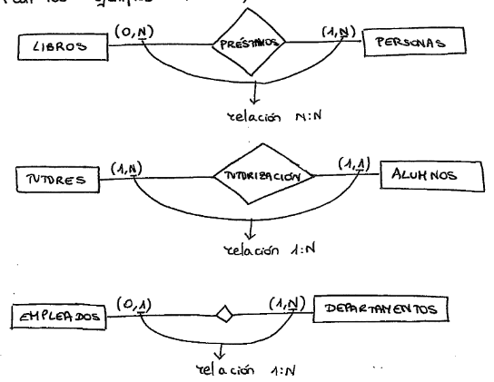

# Modelo BD relacional

## Introducción

Revisión modelos de gestión de bases de datos

## Modelo de datos relacional##

Modelo propuesto en los años 70. Basado en el concepto matemático de
relación, teoría de conjuntos y lógica de predicados

### Objetivos

- Independencia de datos:
  - Física: la forma en las que se almacenan los datos no afecta a su manipulación
  - Lógica: los programas no influyen en la manera de manipular los datos
- Flexibilidad:
  - Los datos se pueden presentar a los usuarios de diferentes maneras
- Uniformidad:
  - Los datos se estructuran siempre de la misma forma (entidades, atributos, relaciones)
- Sencillez:
  - Las estructuras son sencillas y fáciles de manejar

Reglas

## Estructura de datos

### Entidades

Entidad

- El mundo está formado por conjuntos de entidades del mismo tipo
- Es un objeto del mundo real, que tiene interés
- Por ejemplo, los ALUMNOS de un centro escolar o los CLIENTES de un banco.

### Conjunto de entidades

Es un grupo de entidades del mismo tipo, por ejemplo, el conjunto de entidades cliente. Los conjuntos de entidades no necesitan ser disjuntos, se puede definir los conjuntos de entidades de empleados y clientes de un banco, pudiendo existir una persona en ambas o ninguna de las dos cosas.

Representación:

- Se representan con rectángulos
- Sus nombres suelen ir en plural
- Las propiedades de cada entidad se ponen en globos
- Se subraya el identificador de cada entidad

### Entidad fuerte

- Aquella que existe por si misma y tiene un identificador propio, formado por uno o más atributos
- Es aquella que no depende de otra entidad para su existencia.

Ejemplo:

- La entidad ALUMNO es fuerte pues no depende de otra para existir

### Entidad débil

Las entidades débiles se relacionan con la entidad fuerte con una relación uno a varios. Se representan con un rectángulo con un borde doble.

Tiene dependencia de existencia y dependencia de identificación respecto a alguna entidad fuerte
La relación entre una entidad fuerte y una débil siempre va a ser 1:N

- La entidad NOTAS es una entidad débil pues necesita a la entidad ALUMNO para existir.
- En modelo de colegio, grupo es una entidad débil porque no existe si no existe el curso
- Una línea factura/albarán/pedido depende siempre de la factura/albarán/pedido en el que está. Las líneas son una entidad débil

### Atributos o campos

Son las unidades de información que describen propiedades de las entidades.

Por ejemplo, la entidad ALUMNO posee los atributos:

- número de matrícula
- nombre
- dirección
- población
- teléfono.

Los atributos toman valores, por ejemplo, el atributo población puede ser ALCALÁ, GUADALAJARA, etcétera.

Se representan mediante una elipse con el nombre en su interior.

#### Dominio

Es el conjunto de valores permitido para cada atributo. Por ejemplo el dominio del atributo nombre puede ser el conjunto de cadenas de texto de una longitud determinada

### Relaciones

Concepto
s
Tablas, filas, tuplas, atributos o columnas

- Dominio: indica los valores que puede tener una columna de una relación
- Dominios predefinidos: entero, booleano, cadena de carateres
- Dominios definidos por el usuario

Grado de una relación: numero de columnas

Cardinalidad de una relación: numero de filas

### Claves

#### Identificador o superclave

Es el conjunto de atributos que identifican de forma única a cada entidad.
Por ejemplo, la entidad EMPLEADO, con los atributos Número de la Seguridad Social, DNI, Nombre, Dirección, Fecha nacimiento y Tlf, podrían ser identificado-res o superclaves los conjuntos Nombre, Dirección, Fecha nacimiento y Tlf, o también DNI, Nombre y Dirección, o también Num Seg Social, Nombre, Dirección y Tlf, o solos el DNI y el Número de la Seguridad Social.

#### Clave candidata

Es cada una de las superclaves formadas por el mínimo número de campos posibles.
En el ejemplo anterior, son el DNI y el Número de la Seguridad Social.

#### Clave primaria o principal (prímary key)

Una clave primaria es una clave candidata seleccionada por el diseñador de la base de datos para identificar de manera única y distintiva a cada registro de una tabla.

Esta clave no puede contener valores nulos, debe ser fácil de crear y debe permanecer inalterable. Los atributos que la conforman se suelen representar con un subrayado.

#### Clave ajena o foránea (foreign key)

Es el atributo o conjunto de atributos de una entidad que forman la clave primaria en otra entidad.
Las claves ajenas van a representar las relaciones entre tablas.

Por ejemplo, si tenemos por un lado, las entidades ARTÍCULOS, con los atributos código de articulo (clave primaria), denominación, stock. Y, por otro lado, VENTAS, con los atributos Código de venta (clave primaria), fecha de venta, código de articulo, unidades vendidas, el código de articulo es clave ajena pues está como clave primaria en la entidad ARTÍCULOS.

Valores nulos

indican que el contenido de un atributo no tiene ningún valor

cambios en valores lógicos (verdadero, falso, nulo)

Restricciones

Inerentes

Atomicidad

No repetición de tuplas

No ordenación de tuplas

No ordenación de atributos

Semánticas

Atributos no contengan valores nulos

Impedir que ciertos atributos se repitan

### Relaciones

Las **relaciones** son la asociación entre diferentes entidades y se identifican por un nombre de verbo representado por un rombo. Normalmente, no tienen atributos, a no ser que exista una entidad asociada que, al generar una tabla, contenga los atributos de dicha relación. Esto se hace en el modelo relacional para representar los datos.

### Conjunto de relaciones

Conjunto de relaciones del mismo tipo, por ejemplo entre ARTÍCULOS y VENTAS todas las asociaciones existentes entre los artículos y las ventas que tengan estos, forman un conjunto de relaciones.

La mayoría de los conjuntos de relaciones en un sistema de BD son binarias (dos entidades) aunque puede haber conjuntos de relaciones que implican más de dos conjuntos de entidades, por ejemplo, una relación como la relación entre cliente, cuenta y sucursal. Siempre es posible sustituir un conjunto de relaciones no binario por varios conjuntos de relaciones binarias distintos. Así, conceptualmente, podemos restringir el modelo E-R para incluir sólo conjuntos binarios de relaciones, aunque no siempre es posible.

La función que desempeña una entidad en una relación se llama papel, y normalmente es implícito y no se suele especificar. Sin embargo, son útiles cuando el significado de una relación necesita ser clarificado.

Una relación también puede tener atributos descriptivos, por ejemplo, la FECHA_OPERACION en el conjunto de relaciones CLIENTE_CUENTA, que especifica la última fecha en la que el cliente tuvo acceso a su cuenta

### Grado de una relación

Se define grado de una relación como el número de conjuntos de entidades que participan en el conjunto de relaciones, o lo que es lo mismo, el número de entidades que participan en una relación.

- Relaciones binarias (grado 2): Relaciones en las que participan dos entidades
- Relaciones ternarias (grado 3): Si participan tres.
- Relaciones de anillo (grado 1):
- Relaciones en las que sólo participa una entidad

Relaciona una entidad consigo misma, se las llama relaciones reflexivas.
Por ejemplo, la entidad EMPLEADO puede tener una relación JEFE DE consigo misma: un empleado es JEFE DE muchos empleados y, a la vez, el jefe es un empleado.

Los conjuntos de relaciones pueden tener cualquier grado, lo ideal es tener relaciones binarias.
Otro ejemplo puede ser la relación DELEGADO DE los alumnos de un curso: el delegado es alumno también del curso. Ver Figura 1.5.

### Cardinalidades de asignación

En el modelo E-R, las **cardinalidades** de asignación representan restricciones que deben cumplirse para los datos contenidos en una Base de Datos. Estas restricciones se refieren al número de entidades a las que puede asociarse otra entidad mediante un conjunto de relaciones, que son descritas para conjuntos binarios de relaciones.

#### 1:1, uno a uno.

A cada elemento de la primera entidad le corresponde sólo uno de la segunda entidad, y a la inversa. Por ejemplo, un cliente de un hotel ocupa una habitación, o un curso de alumnos pertenece a un aula, y a esa aula sólo asiste ese grupo de alumnos. Ver Figura 1.7:

#### 1:N, uno a muchos.

A cada elemento de la primera entidad le corresponde uno o más elementos de la segunda entidad, y a cada elemento de la segunda entidad le corresponde uno sólo de la primera entidad.
Por ejemplo, un proveedor suministra muchos artículos

#### N:l, muchos a uno.

Es el mismo caso que el anterior pero al revés; a cada elemento de la primera entidad le corresponde un elemento de la segunda, y a cada elemento de la segunda entidad, le corresponden varios de la primera.

#### M:N, muchos a muchos.

A cada elemento de la primera entidad le corresponde uno o más elementos de la segunda entidad, y a cada elemento de la segunda entidad le corresponde uno o más elementos de la primera entidad.
Por ejemplo, un vendedor vende muchos artículos, y un artículo es vendido por muchos vendedores (ver Figura 1.9).

La cardinalidad de una entidad sirve para conocer su grado de participación en la relación, es decir, el número de correspondencias en las que cada elemento de la entidad interviene. Mide la obligatoriedad de correspondencia entre dos entidades.

La representamos entre paréntesis indicando los valores máximo y mínimo: (máximo, mínimo). Los valores para la cardinalidad son: (0,1), (1,1), (0,N), (1,N) y (M,N). El valor 0 se pone cuando la participación de la entidad es opcional.

## Formas normales

Algunos modelos son mejores que otros. En particular, las decisiones deficientes con respecto a las definiciones de entidades pueden aumentar la redundancia de datos
y llevar a la actualización de anomalías.

Las anomalías de actualización incluyen comportamientos tales como requerir información sobre una segunda entidad (por ejemplo, un dormitorio) al insertar información
sobre una primera entidad (por ejemplo, un estudiante) o perder información sobre una segunda entidad (por ejemplo, un dormitorio) cuando una entidad de un Tipo
diferente se elimina (por ejemplo, el último estudiante en el dormitorio). La normalización es el proceso de someter relaciones a las pruebas. Pasar las pruebas
asegurará que la relación mostrará propiedades deseables.

El objetivo de la normalización

- Eliminar redundancias y garantizar
- Garantizar la integridad de la información almacenada

Asegurar que cada relación represente un solo tema.

Por ejemplo, una relación debe tener información sobre los estudiantes, y una relación debe tener información sobre los dormitorios, pero una relación que tiene
información sobre los estudiantes y dormitorios dará lugar a problemas.

Existen varias "formas" normales que han sido identificadas para las bases de datos relacionales.

Los niveles más altos de normalización conducen a diseños que reducen la redundancia de datos y evitan las anomalías de actualización mencionadas anteriormente.

Cualquier forma normal más alta también se ajusta a todas las formas normales inferiores.

Así, una relación en la tercera forma normal (3NF) también está en la segunda forma normal (2NF), y la primera forma normal (INF).

Las discusiones de formas normales se basan en el concepto de dependencia functional. Cuando el valor de un atributo o conjunto de atributos determina el valor de
otro atributo, existe una dependencia funcional y el primer atributo o conjunto de atributos se denomina determinante.Supongamos que hemos creado una relación con
los atributos mostrados en la Figura 8.3.

Teoría de la normalización: objetivo eliminar redundancias y garantizar
la integridad de la información almacenada. Una forma normal incluye las
anteriores.

- 1ª forma normal: Un atributo de una tupla no puede tomar más de un valor
- 2ª forma normal:
- 3ª forma normal
- 4ª forma normal
- 5ª forma normal

## Reglas de integridad

- Reglas de integridad de usuario
- Reglas de integridad de modelo
  - Integridad de unicidad de clave primaria
  - Integridad referencial

## Manipulación de datos

### Algebra relacional

- Lenguaje formal de consultas sobre BD relacionales.
- Inpirada en teoría de conjuntos.
- En una consulta, paso a paso mediante operadores, a partir de 1 o más relaciones como operandos
se obtiene otra relación como resultado.

#### Tipos de operadores

- Conjuntistas (unión, interesección) o especiales (selección, proyección, etc)
- Primitivos o derivados (se pueden o no obtener a partir de otros)
- Unarios o binarios (una o más relaciones como operandos)

#### Operaciones básicas

- Selección: subconjunto de una relación. Tuplas que cumplen una condición determinada
- Proyección: seleccionar todos los valores de atributos especificados eliminando duplicados
- Unión: incluye todas las tuplas de 2 relaciones, descartando repeticiones
- Diferencia: Incluye todas las tuplas de A que no pertenecen a B
- Producto cartesiano: incluye todas las tuplas de 2 relaciones, concatenadas (columnas)

### Operaciones derivadas

#### Intersección

tuplas que pertenecen a la vez a A y a B

#### Combinación

Concatenación de tuplas de A y B que cumplen condiciones
para un valor de atributo común a ambas

#### División

Columnas de A menos columnas de B, solo tuplas que contengan
valores de B

Natural Join
Outer join
Left join
Right join
Full join
Combinación

Composición de operaciones

Cálculo relacional: es no procedimental porque no especifica
procedimiento para obtenerla. Codd especifica dos tipos:

Cálculo relacional de tuplas

Cálculo relacional de dominios

## Diagramas de estructuras

Los diagramas Entidad-Relación representan la estructura lógica de una BD de manera gráfica.
Los símbolos utilizados son los siguientes:

- Rectángulos para representar a las entidades.
- Elipses para los atributos. El atributo que forma parte de la clave primaria va subrayado.
- Rombos para representar las relaciones.
- Líneas, que unen atributos a entidades y a relaciones, y entidades a relaciones.
- Si la línea tiene punta, en ese sentido está el 1, y si no la tiene, en ese sitio está el muchos.
- La orientación señala cardinalidad.
- Si la relación tiene atributos asociados, se le unen a la relación.
- Cada componente se etiqueta con el nombre de lo que representa
